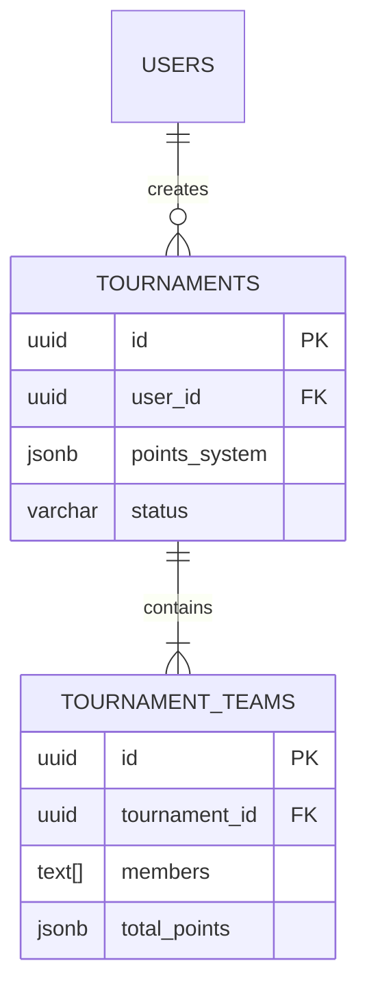

# Database Schema Documentation

This document outlines the database schema for the LazarFlow application, detailing the purpose of each table, its structure, and relationships.

## Overview

The schema is designed to manage e-sports tournaments and participating teams. It handles:
1.  **Tournament Management**: Creating and configuring tournaments.
2.  **Team Management**: Roster and score tracking for teams within tournaments.

---

## Tables

### 1. `public.tournaments`
**Purpose**: The core entity representing an e-sports tournament. It holds configuration details including the game type and scoring rules.

| Column | Type | Description |
| :--- | :--- | :--- |
| `id` | `uuid` | Primary Key. Unique identifier for the tournament. |
| `user_id` | `uuid` | Foreign Key to `auth.users`. The owner/creator of the tournament. |
| `name` | `varchar(255)` | Name of the tournament. |
| `game` | `varchar(50)` | The game being played (e.g., "BGMI", "Valorant"). |
| `points_system` | `jsonb` | Flexible JSON structure defining how points are calculated (placement points, etc.). |
| `kill_points` | `integer` | Points awarded per kill. Default is 1. |
| `status` | `varchar(50)` | Current state of the tournament (e.g., 'active'). |
| `created_at` | `timestamp` | Creation timestamp. |
| `updated_at` | `timestamp` | Last update timestamp. |

**Relationships**:
- **One-to-Many** with `tournament_teams` (A tournament has many teams).

---

### 3. `public.tournament_teams`
**Purpose**: Represents a team participating in a specific tournament. It stores roster information and current standing.

| Column | Type | Description |
| :--- | :--- | :--- |
| `id` | `uuid` | Primary Key. Unique identifier for the team entry. |
| `tournament_id` | `uuid` | Foreign Key to `tournaments`. The tournament this team belongs to. |
| `team_name` | `varchar(255)` | Name of the team. |
| `members` | `text[]` | Array of player names in the team. |
| `total_points` | `jsonb` | Detailed points breakdown: `{ "matches_played": int, "wins": int, "kill_points": int, "placement_points": int }`. |
| `created_at` | `timestamp` | Creation timestamp. |
| `updated_at` | `timestamp` | Last update timestamp. |

**Relationships**:
- **Many-to-One** with `tournaments`.

---

## Entity Relationship Diagram (ERD) Concept

