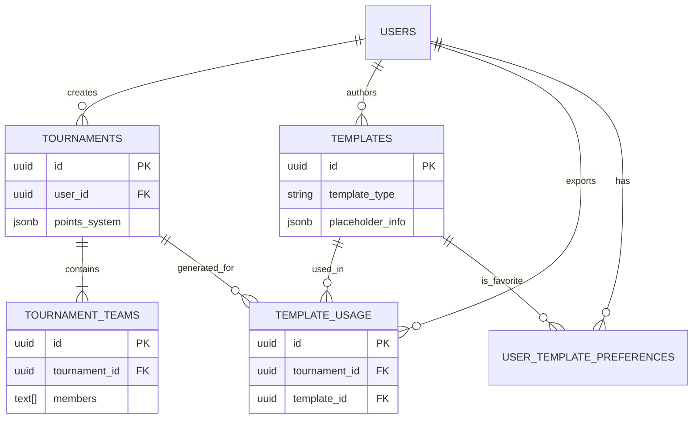

# Database Schema Documentation

This document outlines the database schema for the LazarFlow application, detailing the purpose of each table, its structure, and relationships.

## Overview

The schema is designed to manage e-sports tournaments, participating teams, and the visual templates used to generate graphics (like points tables) for these tournaments. It handles:
1.  **Tournament Management**: Creating and configuring tournaments.
2.  **Team Management**: Roster and score tracking for teams within tournaments.
3.  **Template System**: Managing design templates for generating tournament visuals.
4.  **User Preferences & Usage**: Tracking user favorites and template usage history.

---

## Tables

### 1. `public.tournaments`
**Purpose**: The core entity representing an e-sports tournament. It holds configuration details including the game type and scoring rules.

| Column | Type | Description |
| :--- | :--- | :--- |
| `id` | `uuid` | Primary Key. Unique identifier for the tournament. |
| `user_id` | `uuid` | Foreign Key to `auth.users`. The owner/creator of the tournament. |
| `name` | `varchar(255)` | Name of the tournament. |
| `game` | `varchar(50)` | The game being played (e.g., "BGMI", "Valorant"). |
| `points_system` | `jsonb` | Flexible JSON structure defining how points are calculated (placement points, etc.). |
| `kill_points` | `integer` | Points awarded per kill. Default is 1. |
| `status` | `varchar(50)` | Current state of the tournament (e.g., 'active'). |
| `created_at` | `timestamp` | Creation timestamp. |
| `updated_at` | `timestamp` | Last update timestamp. |

**Relationships**:
- **One-to-Many** with `tournament_teams` (A tournament has many teams).
- **One-to-Many** with `template_usage` (A tournament can have multiple template exports).

---

### 2. `public.tournament_teams`
**Purpose**: Represents a team participating in a specific tournament. It stores roster information and current standing.

| Column | Type | Description |
| :--- | :--- | :--- |
| `id` | `uuid` | Primary Key. Unique identifier for the team entry. |
| `tournament_id` | `uuid` | Foreign Key to `tournaments`. The tournament this team belongs to. |
| `team_name` | `varchar(255)` | Name of the team. |
| `members` | `text[]` | Array of player names in the team. |
| `total_points` | `jsonb` | Detailed points breakdown: `{ "matches_played": int, "wins": int, "kill_points": int, "placement_points": int }`. |
| `created_at` | `timestamp` | Creation timestamp. |
| `updated_at` | `timestamp` | Last update timestamp. |

**Relationships**:
- **Many-to-One** with `tournaments`.

---

### 3. `public.templates`
**Purpose**: Defines the visual layouts available for generating tournament graphics (e.g., points tables, schedule cards).

| Column | Type | Description |
| :--- | :--- | :--- |
| `id` | `uuid` | Primary Key. Unique identifier for the template. |
| `name` | `text` | Display name of the template. |
| `description` | `text` | Optional description of the style or use case. |
| `template_type` | `varchar(50)` | Category of template (e.g., 'points_table', 'match_schedule'). |
| `design_format` | `varchar(20)` | Technical format of the template (e.g., 'html/css', 'canvas', 'image'). |
| `design_url` | `text` | URL to the template asset or code. |
| `preview_image_url`| `text` | URL for a preview image shown in the UI. |
| `placeholder_info` | `jsonb` | Metadata describing data mapping (where team names, points, etc., go). |
| `is_active` | `boolean` | Whether the template is available for use. |
| `created_by` | `uuid` | Foreign Key to `auth.users`. The creator of the template (for community/admin templates). |

**Relationships**:
- **One-to-Many** with `template_usage`.
- **One-to-Many** with `user_template_preferences` (A template can be a favorite).

---

### 4. `public.template_usage`
**Purpose**: An audit or history log tracking when a template is used to export/generate a graphic for a tournament.

| Column | Type | Description |
| :--- | :--- | :--- |
| `id` | `uuid` | Primary Key. |
| `tournament_id` | `uuid` | Foreign Key to `tournaments`. The context of the usage. |
| `template_id` | `uuid` | Foreign Key to `templates`. The design used. |
| `exported_format` | `varchar(50)` | Format of the output (e.g., 'png', 'jpg'). |
| `exported_at` | `timestamp` | When the export happened. |
| `exported_by` | `uuid` | Foreign Key to `auth.users`. Who triggered the export. |

**Relationships**:
- Links `tournaments`, `templates`, and `users`.

---

### 5. `public.user_template_preferences`
**Purpose**: Stores personalized settings for users, specifically their preferred or "favorite" template to load by default.

| Column | Type | Description |
| :--- | :--- | :--- |
| `id` | `uuid` | Primary Key. |
| `user_id` | `uuid` | Foreign Key to `auth.users`. |
| `favorite_template_id`| `uuid` | Foreign Key to `templates`. The user's selected default template. |

**Relationships**:
- **One-to-One** (effectively) per user for a specific preference context.

---

## Entity Relationship Diagram (ERD) Concept

