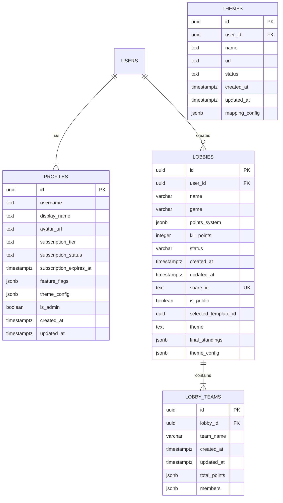

# Database Schema Documentation

This document outlines the database schema for the LazarFlow application, detailing the purpose of each table, its structure, and relationships.

## Overview

The schema is designed to manage e-sports tournaments and participating teams. It handles:
1.  **Tournament Management**: Creating, configuring, and styling tournaments.
2.  **Team Management**: Roster, score tracking, and real-time updates for teams.

---

## Tables

### 1. `public.lobbies`
**Purpose**: The core entity representing an e-sports tournament/lobby. It holds configuration details, scoring rules, and visual customization settings.

| Column | Type | Description |
| :--- | :--- | :--- |
| `id` | `uuid` | **Primary Key**. Unique identifier for the tournament. Default: `gen_random_uuid()`. |
| `user_id` | `uuid` | **Foreign Key** to `auth.users`. The owner/creator of the tournament. On Delete: `CASCADE`. |
| `name` | `varchar(255)` | Name of the tournament. |
| `game` | `varchar(50)` | The game being played (e.g., "BGMI", "Valorant"). |
| `points_system` | `jsonb` | Flexible JSON structure defining how points are calculated (placement points, etc.). |
| `kill_points` | `integer` | Points awarded per kill. Default: `1`. |
| `status` | `varchar(50)` | Current state of the tournament. Default: `'active'`. |
| `created_at` | `timestamptz` | Creation timestamp. Default: `CURRENT_TIMESTAMP`. |
| `updated_at` | `timestamptz` | Last update timestamp. Default: `CURRENT_TIMESTAMP`. |
| `share_id` | `text` | **Unique**. A short ID or slug for sharing the tournament publicly. |
| `is_public` | `boolean` | Visibility flag. Default: `false`. |
| `selected_template_id` | `uuid` | ID of the selected layout template (if applicable). |
| `theme` | `text` | Visual theme identifier. Default: `'darkBlue'`. |
| `final_standings` | `jsonb` | Snapshot of final results. Default: `[]`. |
| `theme_config` | `jsonb` | Custom visual settings (colors, fonts, etc.). Default: `{}`. |

**Indices**:
- `idx_tournaments_user_id` on `user_id`
- `idx_tournaments_status` on `status`
- `idx_tournaments_share_id` on `share_id`

**Relationships**:
- **One-to-Many** with `lobby_teams` (A lobby has many teams).

---

### 2. `public.lobby_teams`
**Purpose**: Represents a team participating in a specific lobby/tournament. It stores roster information and current standings.

| Column | Type | Description |
| :--- | :--- | :--- |
| `id` | `uuid` | **Primary Key**. Unique identifier for the team entry. Default: `gen_random_uuid()`. |
| `lobby_id` | `uuid` | **Foreign Key** to `lobbies`. The lobby this team belongs to. On Delete: `CASCADE`. |
| `team_name` | `varchar(255)` | Name of the team. |
| `created_at` | `timestamptz` | Creation timestamp. Default: `CURRENT_TIMESTAMP`. |
| `updated_at` | `timestamptz` | Last update timestamp. Default: `CURRENT_TIMESTAMP`. |
| `total_points` | `jsonb` | Detailed points breakdown. Default: `{"wins": 0, "kill_points": 0, "matches_played": 0, "placement_points": 0}`. |
| `members` | `jsonb` | JSON structure storing player details. Default: `[]`. |

**Indices**:
- `idx_tournament_teams_tournament_id` on `lobby_id`

**Relationships**:
- **Many-to-One** with `lobbies`.

---

### 3. `public.profiles`
**Purpose**: Stores user-specific data, including profile information, subscription status, and theme preferences.

| Column | Type | Description |
| :--- | :--- | :--- |
| `id` | `uuid` | **Primary Key**. Foreign key to `auth.users(id)`. On Delete: `CASCADE`. |
| `username` | `text` | **Unique**. User's handle. |
| `display_name` | `text` | Public display name. |
| `avatar_url` | `text` | URL for the user's avatar image. |
| `subscription_tier`| `text` | Subscription plan (e.g., 'free', 'pro'). Default: `'free'`. |
| `subscription_status`| `text` | Current status of the subscription. Default: `'active'`. |
| `subscription_expires_at` | `timestamptz` | When the current subscription expires. |
| `feature_flags` | `jsonb` | Flags to enable/disable features for the user. Default: `{}`. |
| `theme_config` | `jsonb` | User-level theme preferences. Default: `{}`. |
| `is_admin` | `boolean` | Administrator flag. Default: `false`. |
| `created_at` | `timestamptz` | Creation timestamp. Default: `now()`. |
| `updated_at` | `timestamptz` | Last update timestamp. Default: `now()`. |

**Relationships**:
- **One-to-One** with `auth.users` (A user has one profile).

---

### 4. `public.themes`
**Purpose**: Stores custom design themes uploaded by users or provided by the system.

| Column | Type | Description |
| :--- | :--- | :--- |
| `id` | `uuid` | **Primary Key**. Unique identifier for the theme. Default: `gen_random_uuid()`. |
| `user_id` | `uuid` | **Foreign Key** to `auth.users`. The creator of the theme. On Delete: `CASCADE`. |
| `name` | `text` | Name of the theme. |
| `url` | `text` | URL to the theme image/resource (can be relative path in storage). |
| `status` | `text` | Verification status: `'pending'`, `'verified'`, or `'rejected'`. Default: `'pending'`. |
| `created_at` | `timestamptz` | Creation timestamp. Default: `now()`. |
| `updated_at` | `timestamptz` | Last update timestamp. Default: `now()`. |
| `mapping_config` | `jsonb` | Configuration for mapping data to the theme visual. Default: `{}`. |

**Constraints**:
- `status` must be one of: `'pending'`, `'verified'`, `'rejected'`.

**Relationships**:
- **Many-to-One** with `auth.users` (via `user_id`).

---

## Entity Relationship Diagram (ERD)

